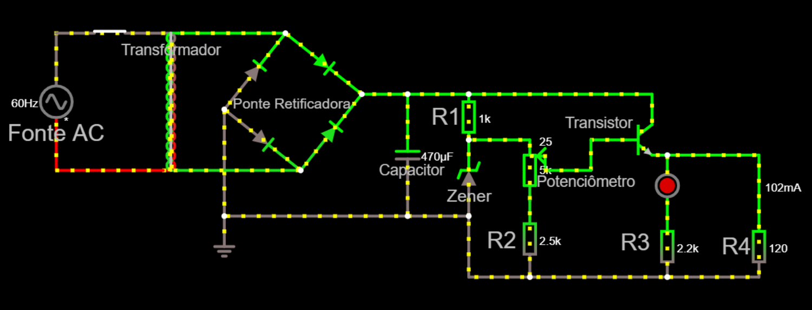
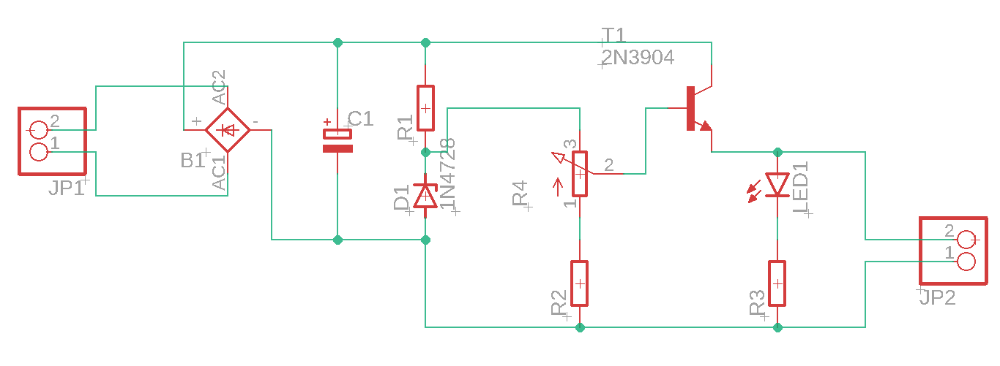

## Objetivo do Projeto
Desenvolver uma fonte elétrica capaz de fornecer energia para pequenos projetos de eletrônica, como projetos de Arduino.
Por conta disso ela deve seguir os critérios a seguir

## Critérios da Fonte
- Componentes elétricos simples
- Tensão Ajustável através de um potenciômetro (3v - 12v)
- Corrente de 100mA

## Precificação dos Componentes
| Componente                      | Quantidade | Preço   | Link                                                                            |
|---------------------------------|------------|---------|---------------------------------------------------------------------------------|
| Transformador 127/220AC -> 15v  | 1          | R$33,15 | [aqui](https://www.baudaeletronica.com.br/transformador-trafo-1a-15v-15v.html)  |
| Diodo Zener 1N4743 13v          | 1          | RS 0,35 | [aqui](https://www.mamuteeletronica.com.br/diodo-zener-1n4743-13v-1w-do-41)     |
| Ponte Retificadora 10A 100V     | 1          | R$ 6,66 | [aqui](https://www.casadoresistor.com.br/ponte-retificadora-10a-1000v-zcdp0003-p4727)                    |
| Potenciômetro Linear 5k R       | 1          | R$ 1,09 | [aqui](https://www.baudaeletronica.com.br/potenciometro-linear-de-5k-5000.html) |
| Transistor NPN 2N222            | 1          | R$ 0,35 | [aqui](https://www.autocorerobotica.com.br/2n222-transistor-npn)                |
| Capacitor 470uf                 | 1          | R$ 1,00 | [aqui](https://www.tecnotronics.com.br/capacitor-eletrolitico-470uf-25v.html)   |
| Resistor 2k R                   | 1          | R$ 0,08 | [aqui](https://www.baudaeletronica.com.br/resistor-2k-5-1-4w.html)              |
| Resistor 300R                   | 1          | R$ 0,08 | [aqui](https://www.baudaeletronica.com.br/resistor-300r-5-1-4w.html)            |
| Resistor 120R                   | 2          | R$ 0,08 | [aqui](https://www.baudaeletronica.com.br/resistor-120r-5-1-4w.html)            |
| LED Difuso Vermelho             | 1          | R$ 0,24 | [aqui](https://www.baudaeletronica.com.br/led-difuso-5mm-vermelho.html)         |
| Total                           |            | R$43,16 |                                                                                 |
## Circuito no Falstad

- Link para o circuito: http://tinyurl.com/ya6ys3xx

## Detalhes do Circuito
### [Video sobre Projeto](https://youtu.be/0voirnk2L9U)

Justificativa para os componentes da fonte

### Ponte Retificadora:
- A ponte de diodos foi introduzida ao circuito para que ele aproveite, tanto o ciclo positivo quanto negativo do circuito, além de impedir a circulação da tensão reversa, que poderia queimar os componentes.

### Diodo Zener (1N4743):
- Esse diodo foi introduzido ao circuito para estabilizar a tensão na fonte, transformando-a em corrente contínua. Seu valor de tensão de ruptura é de 13 volts, para que a tensão final, que será introduzida na saída (ou carga) seja um valor muito próximo, se não for exato, de 12V.

### Capacitor (470uF):
-  O capacitor serve para reduzir a variação da corrente alternada que vem do transformador. Sua capacitância, além de ser diretamente proporcional a intensidade de corrente elétrica, ela determina a velocidade de descarregamento do capacitor. Seu valor foi escolhido para deixar a corrente elétrica em um valor considerável para o regulador controlar, para chegar, no máximo, até a I = 100mA com uma margem de erro de 5% para mais.

### Fonte A.C.: 
- A fonte que foi implantada no circuito representa a tomada. Ela tem a tensão eficaz de 127V.

### Transformador: 
- O transformador implantado no circuito possui a razão de 15V/127V. O transformador recebe 127V como entrada e transforma essa tensão em 15V. As duas tensões podem ser entendidas como a tensão eficaz recebida e transformada. Essa razão pode ser entendida também como o número de espiras em cada bobina do transformador. O denominador da razão, que se refere a tensão recebida, pode ser relacionado como um múltiplo do número de espiras da 1ª bobina e, de maneira análoga, o númerador pode ser relacionado com a 2ª bobina.

### Potenciômetro (5k Ohms): 
- O potenciômetro, com a função de regular a tensão e a corrente elétrica no circuito, foi escolhido com 5k Ohms pois esse é o valor adequado para que a tensão na saída varie entre 3V e 12V.

### Resistor 1 (400 Ohms): 
- O resistor 1 foi aplicado ao circuito para proteger o diodo zener. Caso o resistor não fosse colocado, haveria a possibilidade de passar uma corrente infinita pelo diodo. Assim, o diodo queimaria. O valor do resistor é de 400 Ohms para que o diodo não queime, assim, controlando a corrente elétrica.

### Resistor 2 (2500 Ohms): 
O resistor 2 foi aplicado ao circuito para que, quando o potenciômetro fique no máximo, a tensão na saída fique muito próximo, se não exato, da tensão mínima de saída. O valor de 2.5k Ohms foi escolhido pois é o valor mais adequado para o resistor. Esse valor permite que a tensão minima de saída seja 3V.

### LED Vermelho (2V - 2.5V): 
- O LED foi acrescentado ao circuito para ver se a saída do circuito está sendo alimentada com energia ou não. O LED vermelho foi escolhido devido a sua baixa tensão pois é possivel ter uma melhor visibilidade de sua luz quando o potenciômetro está regulado no mínimo.

### Resistor 3 (120 Ohms): 
- O resistor 3 foi aplicado ao circuito para proteger o LED vermelho. O valor de 120 Ohms foi escolhido para que o LED não queime com uma corrente muito alta.

### Resistor 4 (120 Ohms): 
- O resistor 4 foi aplicado ao circuito para representar a saída. O resistor apresentado possui 120 Ohms pois é a resistência mais adequada para que o circuito conceda a saída uma corrente de, no máximo, I = 100mA e uma voltagem que varia entre 3V a 12V.

### Transisor NPN (2N222): 
- O transistor NPN foi aplicado ao circuito para que ele possa atuar como amplificador de corrente elétrica. O tipo 2N222 foi escolhido para que o transistor do circuito não queimasse com facilidade.
 
## EAGLE - Esquemâtico e PCB
### Esquemático

### PCB

